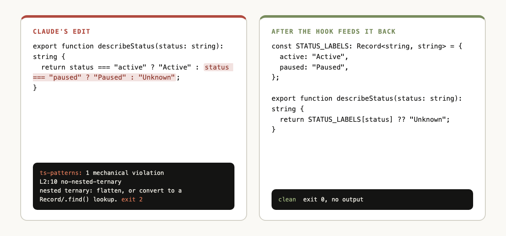

# ts-patterns


**Claude writes TypeScript. ts-patterns checks every edit.**

[](https://github.com/gagoar/typescript-patterns-enforcer/releases)
[](LICENSE)
[](https://gagoar.github.io/typescript-patterns-enforcer/)
[](https://github.com/gagoar/typescript-patterns-enforcer/stargazers)

A Claude Code plugin that holds Claude's TypeScript to a written standard. It has three parts. An inline skill carries the rules. A review subagent handles large changes. A hook checks ten rules after every `.ts` or `.tsx` edit.



## Install

```
/plugin marketplace add gagoar/typescript-patterns-enforcer
/plugin install ts-patterns@ts-patterns
/reload-plugins
```

Prefer one marketplace for all gagoar plugins? Use [gago-plugins](https://gagoar.github.io/gago-plugins):

```
/plugin marketplace add gagoar/gago-plugins
/plugin install ts-patterns@gago-plugins
```

## Why

- **It checks the code, not only the prompt.** A hook reads each file Claude edits. A violation returns to Claude as feedback, and Claude fixes it before moving on.
- **Every check has a test.** Each of the ten checks has a failing fixture and a passing fixture. The suite runs against the built hook.
- **It stays out of the project's config.** The engine ships its own parser and rules. It never reads or writes the repo's ESLint or `tsconfig` setup.

## 30-second tour

Claude writes this:

```ts
export function describeStatus(status: string): string {
  return status === "active" ? "Active" : status === "paused" ? "Paused" : "Unknown";
}
```

The hook replies to Claude:

```
ts-patterns: 1 mechanical violation(s) in describeStatus.ts:
  L2:10  no-nested-ternary  nested ternary — flatten, or convert to a Record/.find() lookup
Fix these to satisfy the TypeScript patterns before continuing.
```

Claude rewrites it:

```ts
const STATUS_LABELS: Record<string, string> = { active: "Active", paused: "Paused" };

export function describeStatus(status: string): string {
  return STATUS_LABELS[status] ?? "Unknown";
}
```

The next check passes with no output.

## What you get

| Component | What it does |
|-----------|--------------|
| Skill `/ts-patterns:check` | Active while Claude writes or edits `.ts` and `.tsx` files. It gives inline guidance on type safety, patterns, and anti-patterns. |
| Agent `ts-patterns:review` | Runs through the Agent tool for full PR reviews, large refactors, and JavaScript to TypeScript conversions. |
| Hook | Runs a bundled checker after every `.ts` or `.tsx` edit and backs the skill with ten deterministic checks. |

## The core rules

1. **No `any`.** Use `unknown` and narrow, or write a precise type.
2. **Explicit return types** on public functions.
3. **`interface` for extendable shapes.** `type` for unions, intersections, and mapped types.
4. **`readonly` by default.**
5. **`async`/`await` only.** No `.then()` chains.
6. **Typed errors.** Custom classes or discriminated-union results.
7. **Constrained generics.** `<TEntity extends BaseEntity>`, not `<T>`.
8. **Composition over inheritance.**
9. **No magic strings or numbers** in comparisons or branching.
10. **Coerce over compare** when the intent is "is it empty" or "is it zero".
11. **Every regex carries an example.** A comment directly above it: plain words, a quoted match and reject, and a pre-filled regex101 link.

The skill covers more: data over logic, validation at the boundary, comment discipline, and a review checklist. Read `skills/check/SKILL.md` for the full text.

## The ten mechanical checks

| Check | Catches |
|-------|---------|
| `no-explicit-any` | A bare `any` |
| `ban-ts-comment` | `@ts-ignore` with no description |
| `no-magic-numbers` | Unnamed numeric literals |
| `prefer-await-to-then` | `.then()` chains |
| `no-switch-statement` | `switch` statements |
| `no-param-reassign` | Parameter mutation |
| `no-loop-statements` | Raw `for` and `while` loops |
| `no-nested-ternary` | Nested ternaries |
| `require-regex-example` | A regex literal with no plain-words comment, example, or tester link above it. Advisory: it checks for a quoted string and an `https://` link. |
| `no-narrative-comment` | Comments that narrate history. Advisory: it matches a list of phrases, so it misses some and flags some. |

The checks find the pattern. Rewriting it well stays with Claude and the skill, because a linter can ban a `switch` but cannot rewrite one.

## What runs automatically

The plugin ships one `PostToolUse` hook, in `hooks/hooks.json`. After Claude edits or writes a file, the hook runs `node engine/dist/check.js`. It reads the hook payload on stdin and the edited file from disk. It checks only `.ts` and `.tsx` files.

The engine's own code writes nothing to disk, makes no network calls, and starts no other process. It prints violations to stderr and exits with code 2, which sends them back to Claude. If Node is missing or the check cannot run, the hook exits with no output. The skill's written rules then remain the only enforcement.

## FAQ

**Does it need ESLint in my project?** No. The engine bundles its own ESLint, parser, and TypeScript. It uses no config from the repo.

**What does it cost?** The skill is prose in Claude's context. The hook runs locally and uses no tokens.

**Which Node version?** The bundle targets Node 18.

## Contributing

Rules and checks live in `engine/src/`. Run `npm ci && npm run release` inside `engine/`. See [`engine/README.md`](engine/README.md) for the build steps.

Full guide: [gagoar.github.io/typescript-patterns-enforcer](https://gagoar.github.io/typescript-patterns-enforcer/guide.html)

## License

MIT. See [LICENSE](./LICENSE).

Icon: "Pattern" by Side Project from [Noun Project](https://thenounproject.com/icon/pattern-8298196/) (CC BY 3.0). See [THIRD_PARTY_NOTICES.md](THIRD_PARTY_NOTICES.md).
